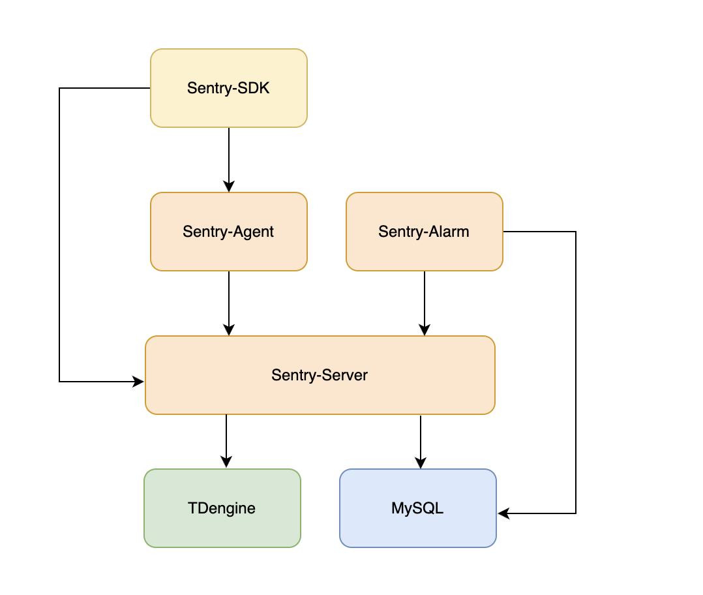

# What is sentry
Sentry is a DevOps monitoring system that collect time series data, display data with dashboard and send alert to users.

# Key Features
* simple architecture
* use push mode to collect metric data
* use agent to collect system metric, use sentry-sdk to collect application metrics
* sdk can send metrics to server directly
* a dashboard to display time series metrics
* sentry-alarm can set 4 type of alarm: threashold, heartbeat, compare and TopN 

# Architecture

# Roadmap
- [ ] add more sentry-sdk for other language
- [ ] add more senty-agent script for system metrics
- [ ] use embeded TSDB and repalce MySQL with SQLite, so sentry-server can be a standalone server
