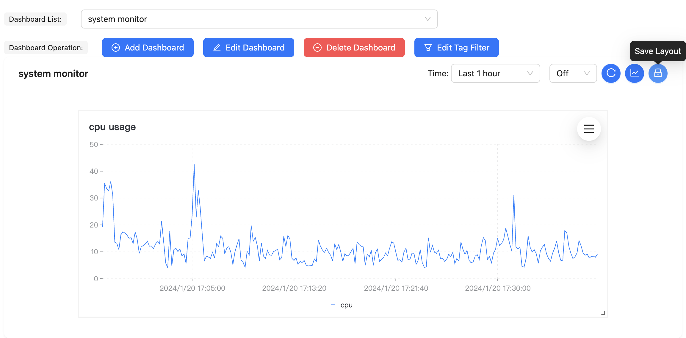

# What is sentry
Sentry is a DevOps monitoring system that collect time series data, store data in TSDB, display data with dashboard and send alert to users.

# Key Features
* simple architecture
* use push mode to collect metric data 
* use an agent to collect system metrics
* use sentry-sdk to collect application metrics, sdk can send metrics to server directly
* a dashboard to display time series metrics
* sentry-alarm can send four type of alarm: heartbeat, threashold, compare and TopN 

# Architecture

# Install

## Install TDengine
* Go to [TDengine install page](https://docs.tdengine.com/get-started/package/#!) to download the latest package for your OS and install it

## Install MySQL
* Go to [MySQL download](https://dev.mysql.com/downloads/mysql/) to downlad the package for your OS and install it

## Install Golang
* Go to [golang download](https://go.dev/dl/) to downlad the package for your OS and install it

## Build sentry
* git clone https://github.com/sentrycloud/sentry.git
* cd sentry/tools
* ./build.sh

## Run sentry_server
* MySQL setup:
	* mysql> source configs/create_tables.sql;
* TDengine setup:
	* taos> CREATE USER sentry PASS '123456';
	* taos> CREATE DATABASE IF NOT EXISTS sentry KEEP 60  DURATION 5;
* tar zxvf sentry_server.tar.gz -C ~/
* cd ~/sentry_server
* ./sentry_server

If everything is OK, it alrealy collect metrics of its own, visit: [http://localhost:51001](http://localhost:51001) for following snapshot:

## Run sentry_agent
*  tar zxvf sentry_agent.tar.gz -C ~/
*  cd ~/sentry_agent 
*  ./sentry_agent 

After a while, you can change the dashboard list to machine monitor:

# Concepts
### Metric
What you want to measure in quantity in a time series, if you want to measure server status, the the metrics are cpu, memory, disk, etc.

### Tags
Tags are the labels attached to the metric, if the metric is server cpu, tags maybe IDC, IP, AppName, etc.

### DownSample
DownSample is the time interval than aggregate a series of data point to a single data point

### Aggregation
DownSampe method for four type of aggregation: sum, avg, max, min

### Data Point
The time series metric value represent by a pair of (timestamp, value)

# Usage
## Dashboard
* add a new dashboard for system metrics
	
* add a new chart for the new empty dashboard
	
* config the new chart
	
* new chart in the new dashboard (add two other chart)
	
* change/save chart layout, the charts in dashboard can be draged and resized
 	

	 	
# Roadmap
- [ ] add more sentry-sdk for other language
- [ ] add more metric collectors for most common systems - Redis, MySQL, Kafka, etc.
- [ ] use embeded TSDB and repalce MySQL with SQLite, so sentry-server can be a standalone server
