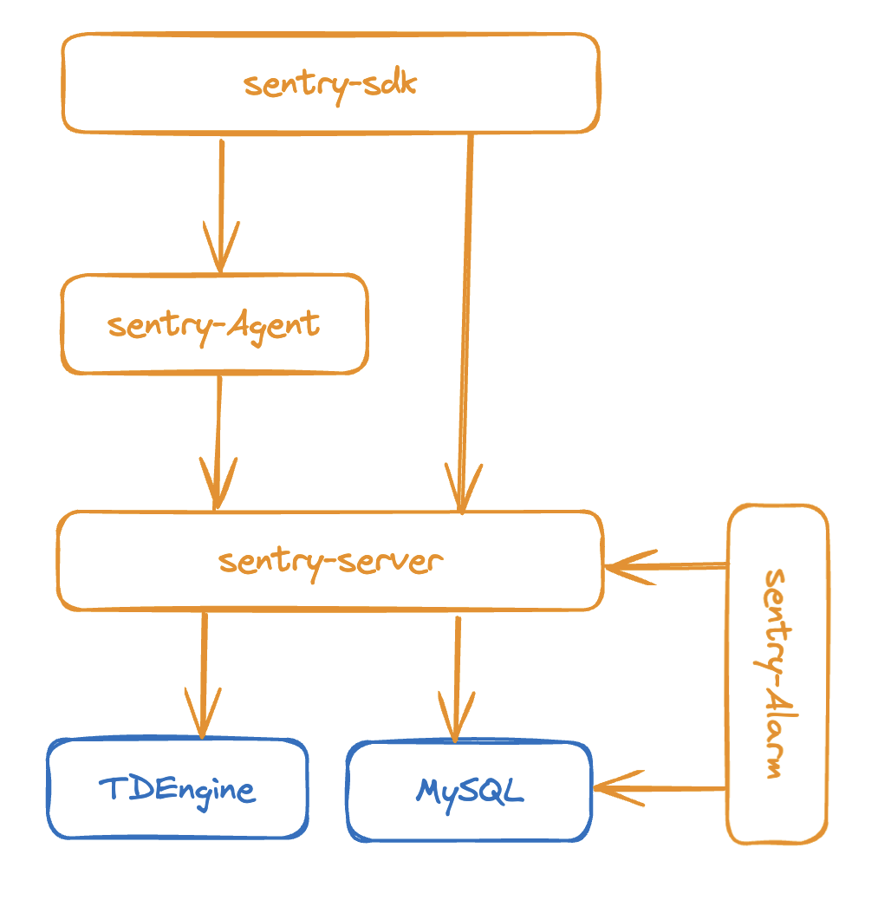

# What is sentry
Sentry is a DevOps monitoring system that collect time series data, store data in TSDB, display data with dashboard and send alert to users.

# Key Features
* simple architecture
* use push mode to collect metric data 
* use an agent to collect system metrics
* use sentry-sdk to collect application metrics, sdk can send metrics to server directly
* a dashboard to display time series metrics
* sentry-alarm can set four type of alarm: heartbeat, threashold, compare and TopN 

# Architecture

# Install

*The commands below are under CentOS 7.2*

## Install TDengine
* go to [TDengine install page](https://docs.tdengine.com/get-started/package/#!) to download a packge for your OS
* change to root user
* rpm -ivh TDengine-server-3.2.2.0-Linux-x64.rpm
* start taos server: systemctl start taosd
* start taos client: taos
* create a user: CREATE USER sentry PASS '123456';
* create a database: CREATE DATABASE IF NOT EXISTS sentry KEEP 60 DURATION 5;

## Install MySQL
* rpm -qa | grep mysql # check to see you installed mysql
* rpm -qa | grep mariadb # check to see you installed mariadb 
* use rpm -e or yum remove to remove these install
* go to [MySQL download](https://dev.mysql.com/downloads/mysql/) to downlad server, client, common, libs 
* rpm -ivh xxx to install libs, common, client and server
* start mysqld: systemctl start mysqld
* get the initial password: grep 'temporary password' /var/log/mysqld.log
* connect to mysql: mysql -uroot -p  enter password in previous step
* mysql> ALTER USER 'root'@'localhost' IDENTIFIED BY 'new_password'
* reconnect with new password
* mysql> set global validate_password_policy='LOW';  
* mysql> set global validate_password_length = 6;  # can set simple test password like 123456
* mysql> CREATE USER 'sentry'@'%' IDENTIFIED BY '123456’; 
* mysql> GRANT ALL ON sentry.* TO 'sentry'@'%';
* reconnect with use sentry: mysql -u sentry -p123456
* mysql> create database sentry;

## Install Golang
* tar zxvf go1.21.6.linux-amd64.tar.gz -C /usr/local/
* edit ~/.bash_profile, add /usr/local/go/bin to PATH, setup GOPATH and GOROOT

## Run sentry_server
* git clone https://github.com/sentrycloud/sentry.git
* cd sentry/tools
* ./build.sh
* inject SQL table and data: mysql> source configs/create_tables.sql;
* tar zxvf sentry_server.tar.gz -C ~/
* change to previous path, run: ./sentry_server
* if everything is OK, it alrealy collect metrics of its own
* visit: http://localhost:51001
 

## Run sentry_agent
* install psutil for collect system metrics(for python 2.7):
	* sudo yum install python-pip
	* sudo yum install python-devel
	* sudo pip install psutil==5.6.2
* for python3.x： sudo pip3 install psutil
*  unzip sentry_agent package: tar zxvf sentry_agent.tar.gz -C ~/
*  cd ~/sentry_agent 
*  ./sentry_agent 

# Usage
## Dashboard
* add a new dashboard for system metrics

* add a new chart for the new empty dashboard

* config the new chart

* new chart in the new dashboard (add two other chart)

* change/save chart layout, the charts in dashboard can be draged and resized
 

	 	
# Roadmap
- [ ] add more sentry-sdk for other language
- [ ] add more senty-agent script for system metrics
- [ ] use embeded TSDB and repalce MySQL with SQLite, so sentry-server can be a standalone server
